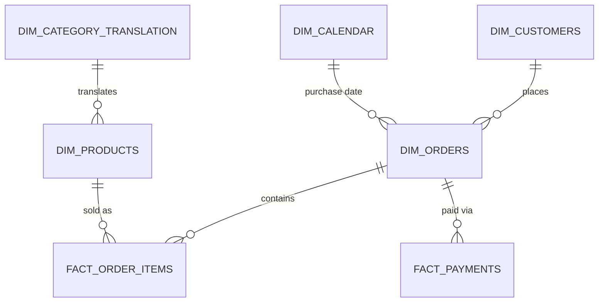

[README.md.md](https://github.com/user-attachments/files/32355943/README.md.md)
# Olist E-Commerce Analysis — Data Analyst Portfolio Project

This project analyzes the Olist Brazilian E-Commerce dataset (about 100,000 orders, Sept 2016 – Aug 2018). I built the same analysis three times — in **Excel**, **SQL (PostgreSQL)**, and **Power BI** — using the same data model and the same questions, and checked that all three tools gave the same numbers.

## Tools

| Tool | What I used it for |
|---|---|
| **Excel** | Power Query (cleaning data), Power Pivot (data model), DAX measures |
| **PostgreSQL** | Raw tables, data cleaning, 10 business questions as SQL queries |
| **Power BI** | Full data model, DAX measures, 3-page interactive dashboard |

## Data

[Olist Brazilian E-Commerce Public Dataset](https://www.kaggle.com/datasets/olistbr/brazilian-ecommerce) — 6 tables: orders, order items, payments, customers, products, and category translations.

**Note:** the data stops around September 2018. This is a known limit of the dataset, not an error. I show this clearly on the dashboard.

## Data Model



## Main Questions

1. What is total revenue, and how does it change each month?
2. How many orders are delivered late — overall, by state, and by category?
3. What are the top 10 categories by revenue?
4. What is the average order value?
5. How does revenue change by payment method?
6. How do customers use installments (credit card)?
7. What is freight cost as a % of product sales?

## Key Findings

- **Revenue:** R$13.59M total, with steady growth in 2017–2018 and a spike in November 2017 (Black Friday).
- **Late deliveries:** 6.77% of orders are late. States far from São Paulo (like Alagoas, 21%) have much higher late rates than São Paulo itself (4.5%). This looks like a distance/logistics problem.
- **Categories:** Furniture items have the highest late rates — probably because they are big and harder to ship.
- **Payments:** Credit card is used for about 80% of revenue. Many customers choose exactly 10 installments — a common "no interest" offer in Brazil.
- **Freight:** 16.57% of product revenue. I calculated this as total freight ÷ total price (not an average of each order's ratio, which gives a misleading higher number).

## What I Learned (Problems I Found and Fixed)

- **Missing categories:** Some products had no category name. I replaced these with "Uncategorized" instead of deleting the data.
- **Date/time bug:** Some date columns had a time value attached. This caused wrong results when comparing dates, so I removed the time part before comparing.
- **Filter direction in DAX:** Some tables only connect through another table, so filters didn't pass through automatically. I fixed this using `CROSSFILTER`.
- **Average order value:** My first formula counted orders with no items, which made the average too low. I fixed the formula to only count orders that had items.
- **Freight %:** Averaging each order's freight % gave a wrong, high number (30.8%). The correct way is total freight ÷ total price (16.57%).
- **Map issue:** Power BI matched Brazilian state codes to US states by mistake (e.g. "AL" = Alabama, not Alagoas). I fixed this by using full state names with "Brazil" added.

## Dashboard

3 pages in Power BI:
1. **Sales Overview** — KPIs, revenue trend, top 10 categories
2. **Delivery Performance** — late delivery % by category and by state (map)
3. **Payment Analysis** — revenue by payment type, installment distribution


## Files

```
├── README.md
├── screenshots/
│   └── sales-overview.png
├── excel/
│   └── Olist E-commerce Analysis.xlsx
├── sql/
│   └── Olist E-commerce Analysis.sql
└── powerbi/
    └── Olist E-commerce Analysis.pbix
```
